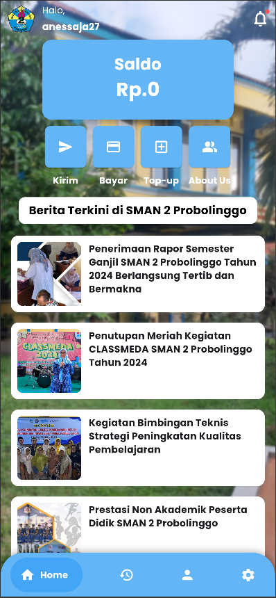

# 💸 Smada Pay App

Smada Pay adalah aplikasi e-wallet buatan saya menggunakan Flutter. Aplikasi ini dibuat sebagai bagian dari latihan, pengembangan portofolio, dan pembelajaran saya dalam pengembangan aplikasi mobile.

## 🚀 Fitur Utama

- 🔐 Login dengan PIN
- 👤 Halaman profil pengguna (foto, nama, email, nomor HP)
- 💰 Top up saldo
- 📤 Kirim saldo ke pengguna lain
- 🏪 Pembayaran ke toko terdaftar
- 📄 Riwayat transaksi lengkap dengan filter dan pencarian
- ⚙️ Halaman pengaturan akun

## 📱 Tampilan Antarmuka

Berikut adalah tampilan utama dari Smada Pay:



> Tangkapan layar halaman beranda Smada Pay – menampilkan saldo, menu utama, dan berita terkini di SMAN 2 Probolinggo.

## 🧠 Tentang Pembuat

**Andrasena Nugraha**  
- 🏫 Lulusan SMAN 2 Probolinggo (2025)  
- 📍 Probolinggo, Indonesia  
- 📸 Aktif di dunia desain, fotografi, dan operator acara  
- 💻 Tertarik dengan mobile development dan UI/UX design  

## 📂 Cara Menjalankan Aplikasi

1. Clone repositori ini
   ```bash
   git clone https://github.com/username/flutter-e-wallet.git
   cd flutter-e-wallet
